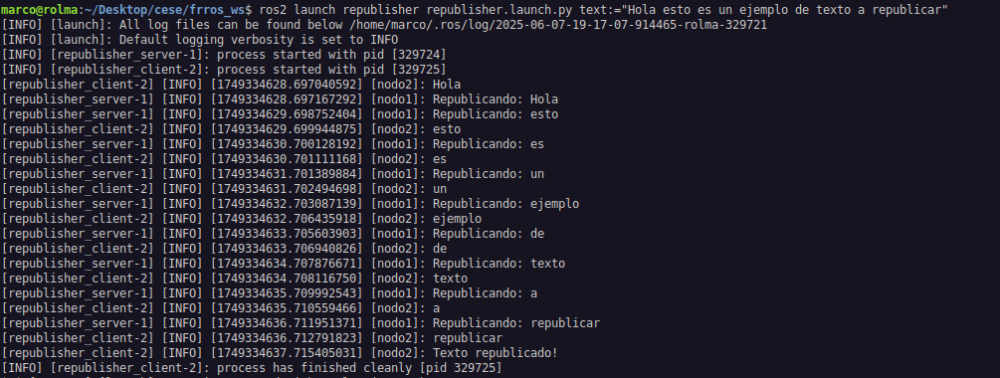

# republisher

## Descripción

Este proyecto implementa un ejemplo práctico de uso de Action Server y Action Client en ROS 2, utilizando un mensaje de acción personalizado.

## Detalles del funcionamiento

El sistema consta de dos nodos principales:

- Nodo servidor:
Recibe un texto completo como meta (`goal`) y lo procesa enviando cada palabra del texto como `feedback` a una frecuencia de 1 Hz.
Cuando termina de enviar todas las palabras, finaliza la acción.

- Nodo cliente:
Recibe un texto como argumento al momento de iniciar.
Envía este texto al nodo servidor mediante una acción.
Se subscribe al `feedback` del servidor y muestra cada palabra recibida en la terminal en tiempo real.
Cuando la acción termina, imprime el mensaje `"Texto republicado!"`.

## Clonar el repositorio

```console
cd ~/ros2_ws/ 
git clone https://github.com/rolma271/republisher.git
```

## Construir el workspace

```console
colcon build --packages-select republisher republisher_interfaces
source install/setup.bash
```

## Cómo lanzar
Lanzar el republicador con parámetros por defecto:

```console
ros2 launch republisher republisher.launch.py
```

Lanzar el republicador con parámetros específicos:

```console
ros2 launch republisher republisher.launch.py text:="Hola esto es un ejemplo de texto a republicar"
```
La salida en consola al ejecutar el comando debería ser la siguiente:




